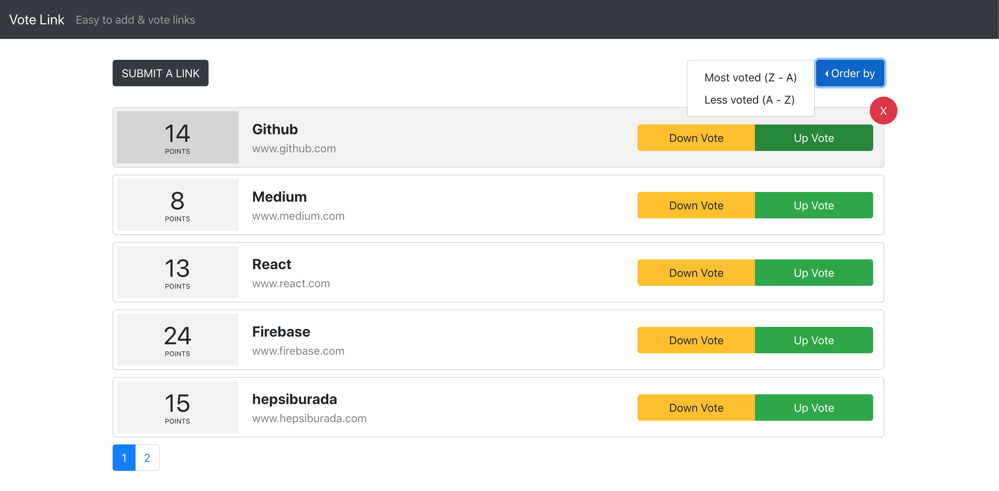

# [`Vote Link`](https://vote-link.web.app/)

Easy to add your links and vote them.

[`Click to see website`](https://vote-link.web.app/)

## Quick Start

Install dependencies: ```npm install```

Run the server locally: ```npm start```

Now project will run on `http://localhost:3000/`



---
## General Structure of the app

Directory of the project overall looks like following:

src<br>
|--components<br>
|--containers<br>
|--contexts<br>
|--reducers<br>
|--utils<br>

---

## Libraries used in the app

- [`react-router`](https://reacttraining.com/react-router/web/guides/quick-start)

- [`node-sass`](https://github.com/sass/node-sass)

- [`react-bootstrap`](https://react-bootstrap.github.io/)

- [`uuid`](https://www.npmjs.com/package/uuid)

- [`moment`](https://momentjs.com/)

- [`enzyme`](https://github.com/airbnb/enzyme)

- [`jest`](https://github.com/facebook/jest)

